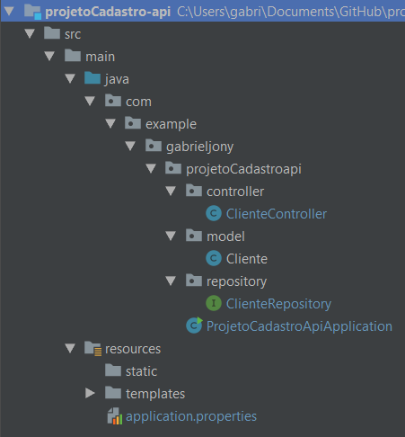
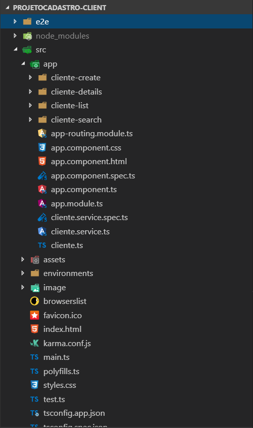

# Cadastro de Cliente com Angular 7 e Spring Boot (PostgreSQL)

Neste CRUD, mostro o exemplo do HttpClient Angular 7 e do Spring Boot Server que usa o Spring Data JPA para fazer CRUD com PostgreSQL para fazer solicitações e receber resposta.

## Estrutura do Projeto
### Spring Boot Server



- A classe do Cliente corresponde ao cliente da entidade e da tabela.
- ClienteRepository é uma interface que estende CrudRepository, será autowired em ClienteController para implementar métodos de repositório e métodos de localização personalizados.
- ClienteController é um controlador REST que possui métodos de mapeamento de solicitação para solicitações RESTful, como: getAllClientes, postCliente, deleteCliente, deleteTodosClientes, findByCpf, updateCliente.
- Configuração para propriedades Spring Datasource e Spring JPA em application.properties
- 4 Dependências para Spring Boot e PostgreSQL em pom.xml, como pode ver abaixo:

``` bash
	<dependencies>
		<dependency>
			<groupId>org.springframework.boot</groupId>
			<artifactId>spring-boot-starter-data-jpa</artifactId>
		</dependency>
    
		<dependency>
			<groupId>org.springframework.boot</groupId>
			<artifactId>spring-boot-starter-web</artifactId>
		</dependency>

		<dependency>
			<groupId>org.postgresql</groupId>
			<artifactId>postgresql</artifactId>
			<scope>runtime</scope>
		</dependency>
    
		<dependency>
			<groupId>org.springframework.boot</groupId>
			<artifactId>spring-boot-starter-test</artifactId>
			<scope>test</scope>
		</dependency>
	</dependencies>
```

### Angular



Neste exemplo, tem:
- 4 components: lista de clientes, detalhes do cliente, criação de cliente, pesquisa de cliente.
- 3 módulos: FormsModule, HttpClientModule, AppRoutingModule.
- cliente.ts: class Cliente (id, nome, cpf)
- cliente.service.ts: serviço para métodos do HttpClient do @angular/common/http

## Instalação dos módulos

``` bash
$ npm install
```

## Serve the application

``` bash
$ ng serve --open
```

## Tecnologias e Arquitetura usadas na Aplicação

1. [Angular 7](https://angular.io/)
2. [Spring Boot 2](https://start.spring.io/) - Dependência: Web, JPA, PostgreSQL
3. [Maven](https://maven.apache.org/)
4. [Java 8](https://www.oracle.com/technetwork/java/javase/downloads/jdk8-downloads-2133151.html)
5. [PostgreSQL 11](https://www.enterprisedb.com/downloads/postgres-postgresql-downloads#windows)
6. [Bootstrap 4](https://getbootstrap.com/)
